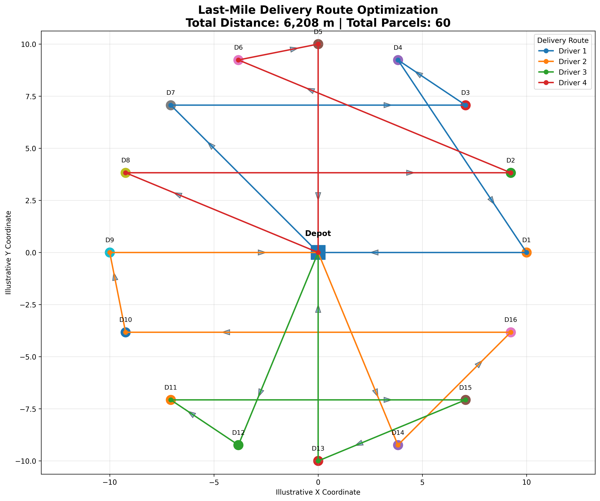
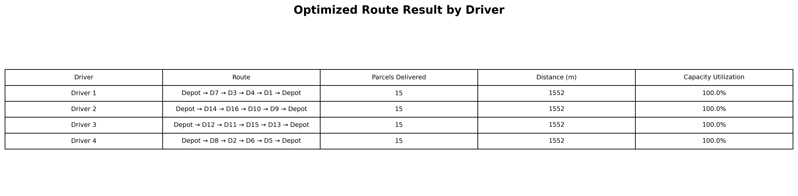

# Last-Mile Delivery Route Optimization using OR-Tools

## Project Overview

This project applies Operations Research to optimize last-mile delivery routes for an e-commerce logistics scenario. The problem is formulated as a **Capacitated Vehicle Routing Problem (CVRP)**, where multiple drivers must deliver parcels to different destinations while respecting vehicle capacity constraints and minimizing total travel distance.

The project demonstrates how route optimization can support last-mile delivery planning, driver workload balancing, vehicle capacity utilization, and logistics cost control.

---

## Business Context

Last-mile delivery is one of the most expensive and operationally complex stages in e-commerce logistics. Inefficient routing can lead to longer travel distance, higher transportation cost, delayed deliveries, unbalanced driver workload, and lower customer satisfaction.

In this project, a delivery service center needs to assign parcels to available drivers while ensuring that each vehicle does not exceed its parcel capacity.

The scenario includes:

| Item | Value |
|---|---:|
| Delivery drivers | 4 |
| Delivery destinations | 16 |
| Total parcels | 60 |
| Vehicle capacity | 15 parcels per driver |
| Optimization problem | Capacitated Vehicle Routing Problem |
| Solver | Google OR-Tools |

---

## Objective

The objective of this project is to:

- Assign all delivery destinations to available drivers
- Deliver all parcels successfully
- Respect vehicle capacity constraints
- Minimize total delivery distance
- Balance driver workload
- Support more efficient last-mile logistics planning

---

## Methodology

The optimization workflow includes the following steps:

1. Load the distance matrix between the depot and delivery destinations.
2. Define parcel demand for each destination.
3. Set the number of vehicles and vehicle capacity constraints.
4. Build a CVRP model using Google OR-Tools.
5. Apply the `PATH_CHEAPEST_ARC` strategy to generate an initial solution.
6. Improve the solution using `GUIDED_LOCAL_SEARCH`.
7. Extract optimized delivery routes for each driver.
8. Export route results, visualization, and business insights for reporting.

---

## Optimization Result

The model successfully assigned all parcels to available drivers while fully respecting vehicle capacity constraints.

| Metric | Result |
|---|---:|
| Total parcels delivered | 60 / 60 |
| Total optimized distance | 6,208 m |
| Average route distance | 1,552 m |
| Vehicle capacity utilization | 100% |
| Number of drivers used | 4 / 4 |

---

## Route Result by Driver

| Driver | Parcels Delivered | Distance |
|---|---:|---:|
| Driver 1 | 15 | 1,552 m |
| Driver 2 | 15 | 1,552 m |
| Driver 3 | 15 | 1,552 m |
| Driver 4 | 15 | 1,552 m |

The result shows that the model created a balanced delivery plan. Each driver delivered exactly 15 parcels and traveled the same route distance of 1,552 meters.

---

## Dashboard / Visualization

### Route Optimization Result

### Route Result Table

---

## Key Business Insights

### 1. All delivery demand was successfully assigned

The model assigned all **60 parcels** to 4 available delivery drivers. This means the delivery plan can fulfill 100% of demand without leaving any destination unserved.

### 2. Vehicle capacity was fully utilized

Each driver delivered exactly **15 parcels**, which matches the maximum vehicle capacity. This indicates that vehicle capacity was used efficiently without exceeding operational constraints.

### 3. Driver workload was highly balanced

The model achieved equal workload allocation across all drivers. Each driver handled the same number of parcels, reducing the risk of driver overload and supporting fair workload distribution.

### 4. Route distance was also balanced

Each driver traveled **1,552 meters**, meaning the solution balanced not only parcel volume but also travel distance. This is valuable for improving route fairness, driver productivity, and logistics planning.

### 5. Route optimization can support cost control

By optimizing delivery routes, logistics teams can reduce unnecessary travel, improve vehicle utilization, and support better planning for last-mile delivery operations.

---

## Business Applications

This project can be applied to:

- Last-mile delivery route planning
- Driver workload allocation
- Vehicle capacity planning
- Logistics cost reduction
- E-commerce fulfillment optimization
- Delivery service-level improvement
- Transportation planning

---

## Tools & Technologies

- Python
- Pandas
- NumPy
- Matplotlib
- Google OR-Tools
- Operations Research
- Capacitated Vehicle Routing Problem

---
